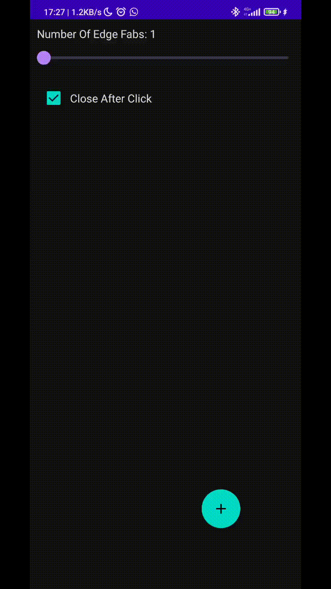

[](https://search.maven.org/search?q=g:%22io.github.hussienfahmy%22%20AND%20a:%22mefab-compose%22) 


MeFab Compose
=====

Floating Action Button but MOVABLE and EXPANDABLE with Compose :)

Available Also as [XML version](https://github.com/Hussienfahmy/MeFab)



Installation
--------
use Gradle:

```gradle
dependencies {
    implementation 'io.github.hussienfahmy:mefab-compose:1.0.0'
}
```

Compatibility & Limits
-------------

- Minimum Android SDK API level is 21.

- Maximum actions (Edge fab) is 3.

How to use
-------------

```kotlin
// this state indicates where the 3 actions will be at the edges (State.EXPANDED)
// or hidden at the center (State.CLOSED)
// IMPORTANT: you have to control this state manually
var meFabState by rememberMeFabState()

Scaffold(
    floatingActionButton = {
        MeFab(
            state = meFabState,
            centralFab = {
                CentralFab(state = meFabState, onClick = {
                    // obviously you need to inverse the state when the center fab clicked
                    meFabState = meFabState.inverse()
                    // more code if you want
                }) {
                    // the content for the center fab
                    Icon(Icons.Filled.Add, "Central Fab")
                }
            },
            fab1 = {
                EdgeFab(state = meFabState, onClick = {
                    // here you can chose to inverse and set the state to CLOSED to make the 
                    // all edgeFabs go to the center or not 

                    meFabState = meFabState.inverse()
                }) {
                    Icon(Icons.Filled.Edit, "Fab 1")
                }
            },
            fab2 = null, // you can edge fabs up to 3
            fab3 = null
        )
    }
) {
    // your app content
}
```

Using By
--------
[GPA Manager](https://play.google.com/store/apps/details?id=com.hussienFahmy.myGpaManager)

Feel free to make a pull request and your app here

Contribution
--------
All contributions are welcome for resolving issues or enhancing performance or any other Idea :)

License
--------

    Copyright (c) 2022 Hussien Fahmy

    Permission is hereby granted, free of charge, to any person obtaining a copy
    of this software and associated documentation files (the "Software"), to deal
    in the Software without restriction, including without limitation the rights
    to use, copy, modify, merge, publish, distribute, sublicense, and/or sell
    copies of the Software, and to permit persons to whom the Software is
    furnished to do so, subject to the following conditions:

    The above copyright notice and this permission notice shall be included in all
    copies or substantial portions of the Software.

    THE SOFTWARE IS PROVIDED "AS IS", WITHOUT WARRANTY OF ANY KIND, EXPRESS OR
    IMPLIED, INCLUDING BUT NOT LIMITED TO THE WARRANTIES OF MERCHANTABILITY,
    FITNESS FOR A PARTICULAR PURPOSE AND NONINFRINGEMENT. IN NO EVENT SHALL THE
    AUTHORS OR COPYRIGHT HOLDERS BE LIABLE FOR ANY CLAIM, DAMAGES OR OTHER
    LIABILITY, WHETHER IN AN ACTION OF CONTRACT, TORT OR OTHERWISE, ARISING FROM,
    OUT OF OR IN CONNECTION WITH THE SOFTWARE OR THE USE OR OTHER DEALINGS IN THE
    SOFTWARE.
